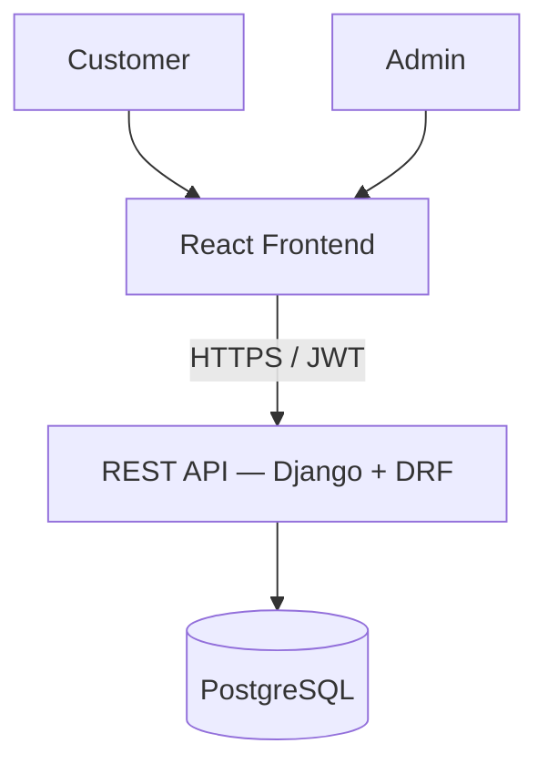

# ShopSphere — Product Requirements Document

**Type:** Full-Stack E-Commerce Platform
**Stack:** React + Tailwind · Django + DRF · PostgreSQL · JWT
**Status:** MVP in development

---

## 1. Overview

ShopSphere is a full-stack e-commerce platform that lets customers browse products, manage a cart, place orders, and track order history, while giving admins full control over the product catalog, inventory, and order fulfillment.

This document defines the MVP scope, functional and non-functional requirements, data model, API contract, and system architecture for engineers, reviewers, and prospective clients evaluating the project.

## 2. Goals

- Customers can discover products (search/filter/sort), manage a cart, check out, and track orders.
- Admins can manage the full product catalog, inventory levels, and order lifecycle.
- The system is secure (JWT-based auth), well-documented (OpenAPI/Swagger), and structured to scale beyond MVP (payments, multi-seller, recommendations).

## 3. User Roles

| Role | Purpose |
|---|---|
| **Customer** | Register/login, browse products, manage cart, place orders, view order history, leave reviews |
| **Admin** | Authenticate, manage products/categories/inventory, view and update orders |

## 4. Scope

### 4.1 In Scope — MVP

**Customer**
| Priority | Feature |
|---|---|
| P0 | Registration / Login (JWT) |
| P0 | Browse products, product details |
| P0 | Shopping cart (add/remove/update items) |
| P0 | Checkout → create order |
| P0 | View order history & order details |
| P1 | Product categories |
| P1 | Search, filter, sort products |
| P2 | Product reviews / ratings |

**Admin**
| Priority | Feature |
|---|---|
| P0 | Admin authentication |
| P0 | Create / update / delete products |
| P1 | Manage categories |
| P1 | Manage inventory |
| P0 | View orders, update order status |
| P1 | View customer order details |

### 4.2 Out of Scope — Later Features

Deliberately excluded from MVP; the architecture leaves room for these:

- Online payments (Stripe/PayPal integration)
- Cloudinary / cloud image storage for products
- Discount / coupon system
- Wishlist
- Email notifications (order confirmation, status updates)
- Product recommendations
- AI shopping assistant
- Multiple sellers / marketplace model
- Analytics dashboard

## 5. Functional Requirements

Each requirement includes trigger, expected behavior, and key edge cases.

### 5.1 Authentication

| ID | Requirement | Details |
|---|---|---|
| FR-1 | Customer registration | Email, password, name. Rejects duplicate emails (409). Password hashed (never stored plain). |
| FR-2 | Customer login | Returns JWT access + refresh token pair on valid credentials; 401 on invalid. |
| FR-3 | Token refresh | Refresh token exchanges for a new access token; expired/invalid refresh → 401, force re-login. |
| FR-4 | Protected endpoints | All cart, order, and profile endpoints require a valid access token (401 if missing/expired). |
| FR-5 | Admin authentication | Separate permission check (`is_staff`/role flag); admin-only endpoints return 403 for non-admins. |

### 5.2 Product Catalog

| ID | Requirement | Details |
|---|---|---|
| FR-6 | Browse products | Paginated list endpoint; default sort by newest. |
| FR-7 | Product details | Single product view with images, price, description, stock status, category, average rating. |
| FR-8 | Search | Case-insensitive match on product name/description. |
| FR-9 | Filter | By category and price range at minimum. |
| FR-10 | Sort | By price (asc/desc) and newest. |
| FR-11 | Categories | Products belong to exactly one category (MVP); category list is admin-managed. |

### 5.3 Cart

| ID | Requirement | Details |
|---|---|---|
| FR-12 | Add to cart | Adding an out-of-stock or already-in-cart item increments quantity (not a duplicate line); blocked if requested qty exceeds stock. |
| FR-13 | Update quantity | Quantity must be ≥1; setting to 0 removes the item. |
| FR-14 | Remove item | Removes line from cart. |
| FR-15 | View cart | Returns items, per-item subtotal, cart total, and stock warnings if any item's stock changed since it was added. |

### 5.4 Orders

| ID | Requirement | Details |
|---|---|---|
| FR-16 | Checkout | Validates cart is non-empty and all items are in stock before creating an order; empty cart → 400 with clear error. |
| FR-17 | Create order | Snapshots product price/name at time of order (so later price changes don't alter historical orders); decrements inventory. |
| FR-18 | Order history | Customer sees only their own orders, newest first. |
| FR-19 | Order details | Line items, quantities, prices at time of order, status, timestamps. |
| FR-20 | Order status update (admin) | Admin transitions status (e.g., Pending → Processing → Shipped → Delivered / Cancelled); invalid transitions rejected. |

### 5.5 Reviews (P2)

| ID | Requirement | Details |
|---|---|---|
| FR-21 | Submit review | One review per customer per product; requires rating (1–5) + optional text. |
| FR-22 | Display reviews | Shown on product detail page with average rating. |

## 6. Data Model

```
User
├── id, email (unique), password_hash, name, role (customer/admin), created_at

Category
├── id, name (unique), slug

Product
├── id, name, description, price, stock_qty, category_id (FK → Category),
│   image_url, created_at, updated_at

CartItem
├── id, user_id (FK → User), product_id (FK → Product), quantity

Order
├── id, user_id (FK → User), status (pending/processing/shipped/delivered/cancelled),
│   total_amount, created_at, updated_at

OrderItem
├── id, order_id (FK → Order), product_id (FK → Product),
│   product_name_snapshot, price_snapshot, quantity

Review
├── id, user_id (FK → User), product_id (FK → Product), rating (1-5), comment, created_at
```

**Key relationships**
- `Product` → `Category`: many-to-one
- `User` → `CartItem` → `Product`: many-to-many through CartItem
- `User` → `Order` → `OrderItem` → `Product`: order items snapshot product data at purchase time so historical orders stay accurate even if a product is later edited or deleted

## 7. API Contract (v1)

Base path: `/api/v1/`

| Method | Endpoint | Auth | Purpose |
|---|---|---|---|
| POST | `/auth/register` | — | Create customer account |
| POST | `/auth/login` | — | Obtain access + refresh token |
| POST | `/auth/refresh` | — | Refresh access token |
| GET | `/products` | — | List products (supports `?search=&category=&sort=&min_price=&max_price=&page=`) |
| GET | `/products/{id}` | — | Product detail |
| GET | `/categories` | — | List categories |
| GET | `/cart` | Customer | View current cart |
| POST | `/cart/items` | Customer | Add item to cart |
| PATCH | `/cart/items/{id}` | Customer | Update item quantity |
| DELETE | `/cart/items/{id}` | Customer | Remove item |
| POST | `/orders/checkout` | Customer | Create order from cart |
| GET | `/orders` | Customer | List own orders |
| GET | `/orders/{id}` | Customer | Order detail |
| GET | `/reviews/product/{id}` | — | List reviews for a product |
| POST | `/reviews` | Customer | Submit a review |
| POST | `/admin/products` | Admin | Create product |
| PATCH | `/admin/products/{id}` | Admin | Update product |
| DELETE | `/admin/products/{id}` | Admin | Delete product |
| PATCH | `/admin/categories/{id}` | Admin | Manage category |
| GET | `/admin/orders` | Admin | List all orders |
| PATCH | `/admin/orders/{id}/status` | Admin | Update order status |

Full interactive spec published via OpenAPI/Swagger at `/api/docs/` (see NFR-5).

## 8. Non-Functional Requirements

| Requirement | Goal |
|---|---|
| Security | JWT auth, role-based permissions, all mutating endpoints protected |
| Performance | Indexed queries on search/filter fields; paginated list endpoints |
| Scalability | Modular Django app structure; stateless API for horizontal scaling |
| Maintainability | Clear app/module boundaries (users, catalog, cart, orders, reviews) |
| API Documentation | OpenAPI schema + Swagger UI |
| Testing | Automated API tests (pytest / DRF test client) for all endpoints above |
| Database | PostgreSQL |
| Version Control | Git + GitHub, feature-branch workflow |
| Deployment | Production-ready config (env-based settings, migrations, static file handling) |
| Responsive UI | React + Tailwind, mobile-first breakpoints |

## 9. Architecture



**Backend modules:** `users`, `catalog` (products/categories), `cart`, `orders`, `reviews` — each a self-contained Django app exposing its own DRF viewset, so features like payments or multi-seller support can be added as new modules without touching existing ones.

## 10. Assumptions & Constraints

- Single currency, single locale for MVP.
- No real payment processing in MVP — checkout creates an order in "pending" status; payment integration is a documented Later Feature.
- Product images stored locally/static for MVP; Cloudinary migration planned post-MVP.
- One admin role for MVP (no granular permission tiers).

## 11. Definition of Done (MVP)

MVP is considered complete when:
1. All P0 features in Section 4.1 are implemented and covered by automated tests.
2. Swagger docs are published and accurate for every endpoint in Section 7.
3. Core flows (register → browse → cart → checkout → order history; admin CRUD → order status update) work end-to-end on a deployed instance.
4. No critical security gaps (protected endpoints verified, passwords hashed, JWT expiry enforced).
